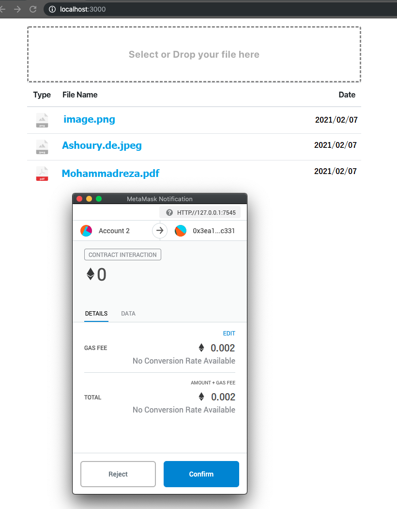

# DDrive - A Secure & Decentralized File Storage App based on IPFS, Ethereum, and React

This a decentralized storage drive based on Ethereume Smart Contract and the InterPlanetary File System protocol.
To build up this App, I used various technologies such as Solidity, React, Truffle, and IPFS.

The frontend app (React) displays the list of files associated with each Eheteum wallet.  Local files will be stored on the IPFS storage. Furthermore,  metadata information (e.g., hash, filename, timestamp, etc.) will be stored in the smart contract's Ethereum storage.

In the event of any changes in Metamask, the frontend app reloads and lists the files.

## Setup & Configuration

1. Clone the repo
2. Install [truffle](https://www.trufflesuite.com/docs/truffle/getting-started/installation)
3. Install [Ganache](https://www.trufflesuite.com/ganache) local blockchain for Ethereum
4. Start Ganache Ethereum server. It should run on localport on port 7545
5. Compile smart contracts `truffle compile`
6. Deploy the smartcontract into the local blockchain - `truffle migrate`
7. Go to client directory - `cd client`
8. instal packages - `npm install`
9. start server - `npm start`

## Testing the app

Simply drop your file to the dropzone window, then the Metamask window will pop up to get a
 confirmation regarding the blockchain transaction associated with your file.

## Screenshot

